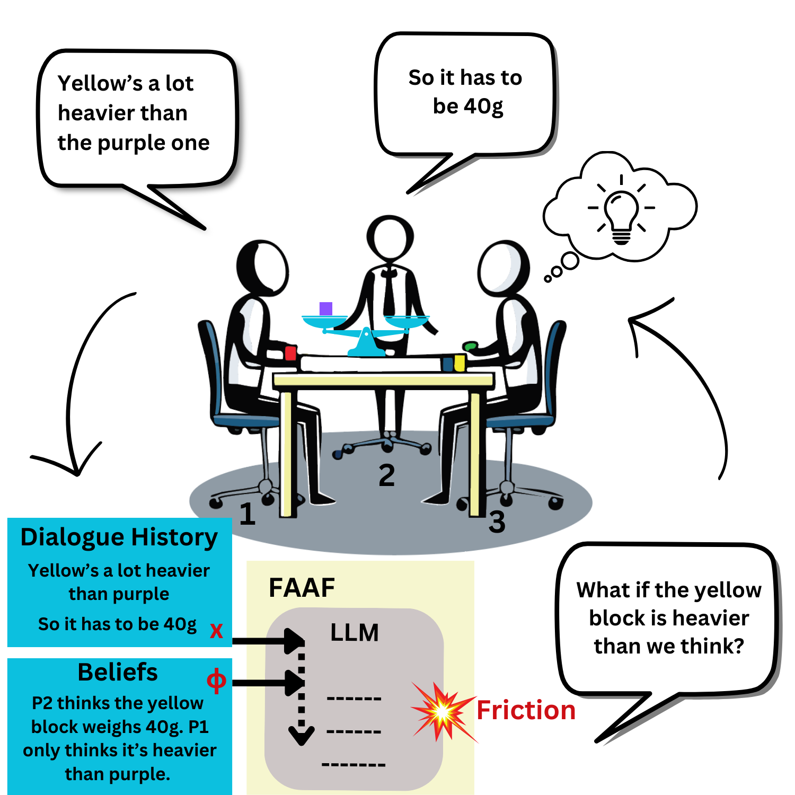

# FAAF_ACL
Code repository for the ACL 2025 Main Conference paper "Frictional Agent Alignment Framework: Slow Down and Don’t Break Things". 
Read our [paper](https://arxiv.org/abs/2505.19428#:~:text=We%20propose%20the%20Frictional%20Agent,re%2Dexamination%20of%20existing%20evidence.).
<p align="center">
  
</p>


# FAAF Implementation Files

## Main Files
* `faaf_config.py` - Configuration and hyperparameter settings for FAAF training
  * Includes definitions for FAAF ablation losses

* `faaf_main_training_file.py` - Main training script for FAAF
  * Supports DPO (loss_type="sigmoid") and IPO (loss_type="ipo") baselines
  * Controls hyperparameter sweeps and logging

* `faaf_trainer.py` - Core FAAF trainer implementation
  * Handles loss computation 
  * Manages phi-unconditioned forward passes
   
 - Implements preference alignment  
  <details>
  <summary><b>FAAF Loss Function (Click to expand)</b></summary>

  ```python
  def faaf_loss(
      self,
      policy_chosen_logps: torch.FloatTensor,      # π_θ(f_w|φ,x)
      policy_rejected_logps: torch.FloatTensor,     # π_θ(f_l|φ,x)
      reference_chosen_logps: torch.FloatTensor,    # π_ref(f_w|φ,x)
      reference_rejected_logps: torch.FloatTensor,  # π_ref(f_l|φ,x)
      policy_chosen_friction_logps: torch.FloatTensor,      # π_θ(f_w|x)
      policy_rejected_friction_logps: torch.FloatTensor,    # π_θ(f_l|x)
      reference_chosen_friction_logps: torch.FloatTensor,   # π_ref(f_w|x)
      reference_rejected_friction_logps: torch.FloatTensor  # π_ref(f_l|x)
  ) -> Tuple[torch.FloatTensor, torch.FloatTensor, torch.FloatTensor, torch.FloatTensor, torch.FloatTensor]:
      """
      FAAF loss combining conditional and unconditioned policy ratios for preference learning.
      Adapted from DPO loss in DPO trainer.

      Returns:
          Tuple of FAAF loss and reward components (all shape: batch_size,)
      """
      chosen_logratios = policy_chosen_logps.to(self.accelerator.device) - (
          not self.reference_free
      ) * reference_chosen_logps.to(self.accelerator.device)

      rejected_logratios = policy_rejected_logps.to(self.accelerator.device) - (
          not self.reference_free
      ) * reference_rejected_logps.to(self.accelerator.device)

``` 
</details>  
  

* `llm_judge_evals.py` - LLM evaluation pipeline
  * Runs pairwise position-swapped evaluations
  * Generates results for Table 1 comparisons

* `opt_reward_modeling.py` - Reward modeling implementation
  * Uses OPT models for reward computation
  * Supports PPO training and Table 2 evaluations

* `ppo_baseline_training.py` - PPO baseline implementation
* `friction_agent_inference.py` - FAAF model inference
  * Handles generation and parsing
  * Computes evaluation metrics

## Usage

## Requirements
Install dependencies: `pip install -r requirements.txt`

All training and evaluation data splits and preference pairs are available at:

1. [WTD Original](https://huggingface.co/datasets/Abhijnan/wtd_original_data)  
2. [WTD Simulated](https://huggingface.co/datasets/Abhijnan/wtd_simulated_data)
3. [Delidata](https://huggingface.co/datasets/Abhijnan/delidata_wasoncard_friction_data)

4. Run training through `faaf_main_training_file.py`
   * Uses configs from `faaf_config.py`
   * Implements FAAF trainer from `faaf_trainer.py`

5. For baselines:
   * Use `opt_reward_modeling.py` for reward modeling
   * Use `ppo_baseline_training.py` for PPO comparison

6. For evaluation:
   * Run `friction_agent_inference.py` for model generations
   * Use `llm_judge_evals.py` for preference scoring

